# Dirac signal processing of higher-order topological  signals  

Lucille Calmon1, Michael T. Schaub2 and Ginestra Bianconi1,3

1School of Mathematical Sciences, Queen Mary University of London, London, E14NS, United Kingdom 

2Department of Computer Science, RWTH Aachen University, Ahornstrasse 55,52074 Aachen, Germany 

3The Alan Turing Institute, 96 Euston Rd, London NW1 2DB, United Kingdom 

E-mail: ginestra.bianconi@gmail.com 

Abstract. Higher-order networks can sustain topological signals which are variables associated not only to the nodes, but also to the links, to the triangles and in general to the higher dimensional simplices of simplicial complexes. These topological signals can describe a large variety of real systems including currents in the ocean, synaptic currents between neurons and biological transportation networks. In real scenarios topological signal data might be noisy and an important task is to process these signals by improving their signal to noise ratio. So far topological signals are typically processed independently of each other. For instance, node signals are processed independently of link signals, and algorithms that can enforce a consistent processing of topological signals across different dimensions are largely lacking. Here we propose Dirac signal processing, an adaptive, unsupervised signal processing algorithm that learns to jointly filter topological signals supported on nodes, links and triangles of simplicial complexes in a consistent way. The proposed Dirac signal processing algorithm is formulated in terms of the discrete Dirac operator which can be interpreted as "square root" of a higher-order Hodge Laplacian. We discuss in detail the properties of the Dirac operator including its spectrum and the chirality of its eigenvectors and we adopt this operator to formulate Dirac signal processing that can filter noisy signals defined on nodes, links and triangles of simplicial complexes. We test our algorithms on noisy synthetic data and noisy data of drifters in the ocean and find that the algorithm can learn to efficiently reconstruct the true signals outperforming algorithms based exclusively on the Hodge Laplacian.

### 1. Introduction 

Recently, higher-order network models [1-5] that capture many-body interactions within complex systems have gained increasing attention. Indeed, a vast number of systems ranging from the brain [6,7] to social and collaboration networks include interactions between two or more nodes that can be encoded in (simplicial) complexes and hypergraphs. Higher-order networks and simplicial complexes not only reveal the  topology of data [6,8–10] but have also transformed our understanding of the interplay between structure and dynamics [1,3,11] in networked systems. In fact these higher order networks can support topological signals [12–17], i.e. variables not only associated to the nodes of a network but associated also to the links, to the (filled) triangles and in general to the higher dimensional simplices of simplicial complexes. Examples of topological signals include the number of citations that a team of collaborators have acquired in their co-authored papers, and link signals associated to the link of a network or of a simplicial complex. The latter include, for instance, synaptic signals and link-signals defined on links connecting brain regions [18,19]. Interestingly, vector fields, such as currents at different locations in the ocean [16] or speed of wind at a given altitude, can also be projected into a spatial tessellation and be treated as topological signals associated to the links of the tessellation. These topological signals reveal important aspects of the interplay between structure and dynamics on networked structures, which can be fully accounted for only by using the mathematical tools of discrete topology [20] and discrete exterior calculus [21]. On one side it has been recently shown that topological signals undergo collective phenomena that display a rich interplay between topology and dynamics [13,14,22–28]. On the other side topological signal data can be processed by machine learning and signal processing algorithms [12, 15, 16, 29], including neural networks [30–32] which make use of algebraic topology.

In the last years signal processing on non-Euclidean domains such as graphs has received large attention [33]. Using variants of the Hodge Laplacian operators [20, 34],these ideas have been extended to signal processing on simplicial complexes and other topological spaces [12, 15,17,35–41] and found their way into extensions of graph neural networks [29,30,42–46]. Further, current approaches build both on the Hodge Laplacians or the Magnetic Laplacian [47–49] to effectively extract information from higher-order or directed network data. However, despite great progress achieved so far, most current signal processing algorithms focus only on the processing of topological signals of a given dimension, e.g., flows on links. Algorithms to jointly filter topological signals of different dimensions, e.g., to enforce certain consistency relationships between node and link signals, are currently mostly lacking.

In this work we fill this gap by proposing Dirac signal processing, an algorithm which learns to jointly filter topological signals of different dimensions, coupled via appropriate boundary maps as encapsulated in the Dirac operator [50,51]. The discrete Dirac operator [50–54], is defined as the sum between the exterior derivative and its dual and can intuitively be understood as a square root of the (Hodge) Laplacian operator.This operator has recently been shown to be key to treat dynamics of topological signals of different dimensions on networks, simplicial and cell complexes [23–25,50],To illustrate the utility of our approach we consider a signal smoothing task, in which a regularization based on the Dirac operator is used, to filter out noise in a topological signal in an adaptive and unsupervised fashion. In particular, this improves upon an algorithm based on the normalized Dirac operator that we presented in a preliminary work [55]. As detailed later on, the here proposed Dirac signal processing algorithm  has the main advantage of adaptively learning its main parameter, as opposed to the preliminary method from [55]. This adaptability enables the algorithm to maintain a good performance over a wider range of signals than Ref. [55]. To show this, we test our Dirac signal processing algorithm on both synthetic and real topological signals defined on nodes, links and (filled) triangles of networks and simplicial complexes. We find a very good performance of the algorithm under a wide set of conditions which typically outperform algorithms based exclusively on the Hodge Laplacian.

The paper is structured asfollows. In Section 2 we provide the background onthe Dirac operator and its spectral properties; in Section 3 we formulate Dirac signal processing; in Section 4 we discuss the result obtained by applying the proposed algorithm to synthetic and real data. Finally, in Section 5 we provide some discussion and concluding remarks. Two Appendices containing details on the convergence of the algorithm and on its complexity follow.

### 2. The Dirac operator on simplicial complexes and its spectral properties 

#### 2.1. Simplicial complexes and topological spinors 

Simplicial complexes are higher-order networks [1] built from simplices. A n-dimensional simplex is a set of $n+1$ nodes; therefore, a 0-simplex is a node, a l-simplex is a link, a 2-simplex is a triangle, etc. Note that for simplifying the terminology here and in the following we will always refer to filled triangles simply as triangles. Here we consider simplicial complexes K of dimension $d=2$ formed exclusively by nodes, links and triangles which reduce to simplicial complexes of dimension $d=1$ (networks) in absence of triangles. We indicate with $N_{[n]}$ the number of simplices of dimension n, i.e. the considered simplicial complexes have $N_{[0]}$ nodes,$N_{[1]}$ links and $N_{[2]}$ triangles.In algebraic topology [1, 56], the n-simplices are associated to an orientation, typically induced by the node labels. In our signal processing setting, each simplex of the simplicial complex K is associated with a topological signal, which can describe either a node, a link or a triangle variable. Example of link signals are biological fluxes, or even electric currents.In a scientific collaboration networks topological signals can encode, for instance, the number of citations that each single author, each pair of co-authors and each triple of co-authors has received from their joint works.

All the topological signals defined on a given simplicial complex are captured by a topological spinor $\mathbf{s}\in C^{0}\oplus C^{1}\oplus C^{2}$ which is the direct sum of signal defined on nodes,links and triangles, i.e.cochains in $C^{n}$ with $n=0,1,2$ respectively, or equivalently,

$\mathbf{s}=\left(\begin{array}{c}{\mathbf{s}_{0}}\\ {\mathbf{s}_{1}}\\ {\mathbf{s}_{2}}\\ \end{array}\right),$ 

$$\mathbf{s}=\left(\begin{array}{c}{\mathbf{s}_{0}}\\ {\mathbf{s}_{1}}\\ {\mathbf{s}_{2}}\\ \end{array}\right),$$

$d=2$ where b $\mathbf{s}_{n}\in\mathbb{R}^{N_{[n]}}$ l simplicial complex K.

## Diracigsiooo 

#### 2.2. The Dirac operator 

The Dirac operator D is a linear operator that acts on the topological spinor [24,50,51,57,58]. In the canonical basis of topological spinors of a $d=2$ dimensional simplicial complex, the Dirac operator D has the block structure 

$$\mathbf{D}=\left(\begin{array}{c c c}{0}&{\mathbf{B}_{[1]}}&{0}\\ {\mathbf{B}_{[1]}^{\top}}&{0}&{\mathbf{B}_{[2]}}\\ {0}&{\mathbf{B}_{[2]}^{\top}}&{0}\end{array}\right)$$

where $\mathbf{B}_{[n]}$ is the $N_{[n-1]}\times N_{[n]}$ boundary matrix of order $n\geq1$ and $\mathbf{B}_{[n]}^{\top}$ the coboundary matrix (for the definition of boundary matrix see for instance [1]).

We notice that the Dirac operator can be considered the "square root" of the superLaplacian operator $\mathcal{L}$ , i.e.

$$\mathbf{D}^{2}=\mathcal{L}=\left(\begin{array}{c c c}{\mathbf{L}_{[0]}}&{0}&{0}\\ {0}&{\mathbf{L}_{[1]}}&{0}\\ {0}&{0}&{\mathbf{L}_{[2]}}\end{array}\right),$$

where $\mathbf{L}_{[n]}$ indicates the Hodge Laplacian of dimension n, where 

$$\mathbf{L}_{[0]}=\mathbf{B}_{[1]}\mathbf{B}_{[1]}^{\top},$$

and for $n\geq1$ 

$$\mathbf{L}_{[n]}=\mathbf{B}_{[n]}^{\top}\mathbf{B}_{[n]}+\mathbf{B}_{[n+1]}\mathbf{B}_{[n+1]}^{\top}.$$

Note that for simplicial complexes of dimension $d=2$ we put $\mathbf{B}_{[3]}=\mathbf{0}$ while for simplicial complexes of dimension $d=1$ (i.e. networks) we put also $\mathbf{B}_{[2]}=\mathbf{0}$ 

The Hodge Laplacian $\mathbf{L}_{[n]}$ describes diffusion-like dynamics [14,26] occurring among n-dimensional simplices and can be decomposed into two terms $\mathbf{L}_{[n]}=\mathbf{L}_{[n]}^{u p}+\mathbf{L}_{[n]}^{d o w n}$ with $\mathbf{L}_{[n]}^{u p}=\mathbf{B}_{[n+1]}\mathbf{B}_{[n+1]}^{\top}\;\mathrm{a n d}\;\mathbf{L}_{[n]}^{d o w n}=\mathbf{B}_{[n]}^{\top}\mathbf{B}_{[n]}$ describing diff usion through $(n{+}1)$ )-dimensional simplices and $(n-1)$ )-dimensional simplices respectively.

An important topological property is that the boundary of a boundary is null, hence 

$\mathbf{B}_{[n]}\mathbf{B}_{[n+1]}=\mathbf{0}\mathrm{~a n d~}\mathbf{B}_{[n+1]}^{\top}\mathbf{B}_{[n]}^{\top}=\mathbf{0}\mathrm{~w i t h~}n\geq1$ 

This property has the direct consequence that 

$$\mathbf{L}_{[n]}^{d o w n}\mathbf{L}_{[n]}^{u p}=\mathbf{L}_{[n]}^{u p}\mathbf{L}_{[n]}^{d o w n}=\mathbf{0},$$

which implies 

$$\operatorname{i m}(\mathbf{L}_{[n]}^{\mathit{d o w n}})\subseteq\ker(\mathbf{L}_{[n]}^{\mathit{u p}}),\quad\operatorname{i m}(\mathbf{L}_{[n]}^{\mathit{u p}})\subseteq\ker(\mathbf{L}_{[n]}^{\mathit{d o w n}}).$$

Therefore any signal supported on the n-dimensional simplicesof a simplicial complex can be uniquely decomposed into the sum of three terms: one in the kernel of $\mathbf{L}_{[n]}$ ,one n te mage of $\mathbf{L}_{[n]}^{u p}$ and one in the image of $\mathbf{L}_{[n]}^{d o w n}$ ,

$$\mathbb{R}^{N_{[n]}}=\ker(\mathbf{L}_{[n]})\oplus\operatorname{i m}(\mathbf{L}_{[n]}^{u p})\oplus\operatorname{i m}(\mathbf{L}_{[n]}^{d o w n}).$$

Ti topology. For signalsdefinedon links,this impliesa unique decompositionintoan harmonic, a solenoidal and an irrotational component [1, 56].

## Dirac signal processingof higher-order topological signals 

#### 2.3. Dirac decomposition 

Similar to the Hodge decompositionasignal decompositionof thetopological spinors based on theDiracoperator canbe derived.Forthis,notefirstthattheDiracoperator can be written as 

$$\mathbf{D}=\mathbf{D}_{[1]}+\mathbf{D}_{[2]}$$

where $\mathbf{D}_{[n]}$ are defined as 

$$\mathbf{D}_{[1]}=\left(\begin{array}{c c c}{0}&{\mathbf{B}_{[1]}}&{0}\\ {\mathbf{B}_{[1]}^{\top}}&{0}&{0}\\ {0}&{0}&{0}\\ \end{array}\right),\quad\mathbf{D}_{[2]}=\left(\begin{array}{c c c}{0}&{0}&{0}\\ {0}&{0}&{\mathbf{B}_{[2]}}\\ {0}&{\mathbf{B}_{[2]}^{\top}}&{0}\\ \end{array}\right).$$

This implies the following properties. First, the squares of $\mathbf{D}_{[n]}$ are given by 

$$\begin{array}{r}{\mathbf{D}_{[1]}^{2}=\mathcal{L}_{[1]}=\left(\begin{array}{c c c}{\mathbf{L}_{[0]}}&{\mathbf{0}}&{\mathbf{0}}\\ {\mathbf{0}}&{\mathbf{L}_{[1]}^{d o w n}}&{\mathbf{0}}\\ {\mathbf{0}}&{\mathbf{0}}&{\mathbf{0}}\end{array}\right),}\\ {\mathbf{D}_{[2]}^{2}=\mathcal{L}_{[2]}=\left(\begin{array}{c c c}{\mathbf{0}}&{\mathbf{0}}&{\mathbf{0}}\\ {\mathbf{0}}&{\mathbf{L}_{[1]}^{u p}}&{\mathbf{0}}\\ {\mathbf{0}}&{\mathbf{0}}&{\mathbf{L}_{[2]}^{d o w n}}\end{array}\right).}\end{array}$$

Secondly we note that $\mathbf{D}_{[1]}$ and $\mathbf{D}_{[2]}$ commute and satisfy 

$$\mathbf{D}_{[1]}\mathbf{D}_{[2]}=\mathbf{D}_{[2]}\mathbf{D}_{[1]}=\mathbf{0}$$

which implies 

$$\operatorname{i m}(\mathbf{D}_{[2]})\subseteq\operatorname{k e r}(\mathbf{D}_{1}),\quad\operatorname{i m}(\mathbf{D}_{[1]})\subseteq\operatorname{k e r}(\mathbf{D}_{[2]}).$$

Stated differently, we have what we call a Dirac decomposition:

$$\mathcal{C}=\ker(\mathbf{D})\oplus\operatorname{i m}(\mathbf{D}_{[1]})\oplus\operatorname{i m}(\mathbf{D}_{[2]}).$$

Note that the kernel of the Dirac operator, ker(D) is given by 

$$\ker(\mathbf{D})=\ker(\mathbf{L}_{[0]})\oplus\ker(\mathbf{L}_{[1]})\oplus\ker(\mathbf{L}_{[2]})$$

and its dimension is therefore given by the sum of the Betti numbers $\beta_{n}$ of the simplicial complex:

$$\mathrm{dim}\ \mathrm{ker}(\mathbf{D})=\beta_0+\beta_1+\beta_2.$$

From the Dirac decomposition it follows that a signal s defined on nodes, links and triangles can be decomposed uniquely into the sum of an harmonic signal $s_{\mathrm{h a r m}}\in$ ker(D) and two signals $\mathbf{s}_{[\mathbf{1}]}$ in the image of $\mathbf{D}_{[1]}$ and $\mathbf{s_{[2]}}$ an taen elf $\mathbf{D}_{[2]}$ , respectively:

$$\mathbf{s}=\mathbf{s}_{[1]}+\mathbf{s}_{[2]}+\mathbf{s}_{\mathrm{h a r m}}.$$

Note that $\pmb{s}_{[1]}$ is a topological spinor of non-zero elements on both nodes and links while $\pmb{s}_{[2]}$ is a topological spinor of non-zero elements on both links and triangles. The two signals $\mathbf{S}_{[n]}$ with $\mathbf{s}_{[n]}\in\mathrm{i m}(\mathbf{D}_{[n]})$ can be written as 

$$\mathbf{s}_{[n]}=\mathbf{D}_{[n]}\mathbf{w}_{[n]},$$

Dirac signal processing of higher-order topological signals 

where $\mathbf{W}_{[n]}$ can be found by minimizing 

$$\mathbf{w}_{n}=\mathrm{a r g m i n}_{\mathbf{w}_{[n]}}\|\mathbf{D}_{[n]}\mathbf{w}_{[n]}-\mathbf{s}\|_{2},$$

which leads to 

$$\mathbf{w}_{[n]}=\mathbf{D}_{[n]}^{\dagger}\mathbf{s},$$

where $\mathbf{D}_{[n]}^{\dagger}$ indicates the pseudoinverse of $\mathbf{D}_{[n]}$ . It follows that $\mathbf{s}_{[1]}$ and $\mathbf{s}_{[2]}$ can be expressed as 

$$\mathbf{s}_{[n]}=\mathbf{D}_{[n]}\mathbf{D}_{[n]}^{\dagger}\mathbf{s},$$

with $n\in\{1,2\}$ 

#### 2.4. Eigenvalues and eigenvectors of the Dirac operator 

Let us now exploit the fact that $\mathbf{D}_{[n]}^{2}=\mathcal{L}_{[n]}$ ,i.e. Eq. (11) to relate the eigenvalues of the Dirac operators $\mathbf{D}_{[n]}$ to the eigenvalues of the Hodge Laplacians $\mathbf{L}_{[n-1]}^{{u p}}$ and $\mathbf{L}_{[n]}^{{d o w n}}$ Since $\mathbf{L}_{[n-1]}^{u p}{\mathrm{~a n d~}}\mathbf{L}_{[n]}^{d o w n}$ are isospectral, ie. they have the same non-zero spectrum, from $\mathrm{E q}$  (11) it follows the non-zero eigenvalues of $\mathbf{D}_{[n]}$ indicated as λ satisfy 

$$\lambda=\pm\sqrt{\mu},$$

where  are the non-zero eigenvalues of $\mathbf{L}_{[n-1]}^{u p}$ . Therefore for any positive eigenvalue λthe operator $\mathbf{D}_{[n]}$ admits a negative eigenvalue $\lambda^{\prime}=-\lambda$ 

The eigenvectors associated to non-zero eigenvalues of the operator $\mathbf{D}_{[n]}$ are related by chirality for both $n=1$ , 2. To see this, let us introduce the matrices $\gamma_{[n]}$ given by 

$$\begin{array}{r}{\pmb{\gamma}_{[1]}=\left(\begin{array}{c c c}{\mathbf{I}}&{\mathbf{0}}&{\mathbf{0}}\\ {\mathbf{0}}&{-\mathbf{I}}&{\mathbf{0}}\\ {\mathbf{0}}&{\mathbf{0}}&{\mathbf{0}}\end{array}\right),\quad\pmb{\gamma}_{[2]}=\left(\begin{array}{c c c}{\mathbf{0}}&{\mathbf{0}}&{\mathbf{0}}\\ {\mathbf{0}}&{\mathbf{I}}&{\mathbf{0}}\\ {\mathbf{0}}&{\mathbf{0}}&{-\mathbf{I}}\end{array}\right).}\end{array}$$

It is easy to check that the Dirac operator $\mathbf{D}_{[n]}$ anticommutes with $\upgamma_{[n]}$ ,i.e.

$$\{\mathbf{D}_{[n]},\mathbf{\gamma}_{[n]}\}=\mathbf{D}_{[n]}\mathbf{\gamma}_{[n]}+\mathbf{\gamma}_{[n]}\mathbf{D}_{[n]}=\mathbf{0}.$$

Hence if we denote by $\phi_{n}^{+}$ an eigenvector of $\mathbf{D}_{[n]}$ with eigenvalue $\lambda>0$ we assume that 

$$\mathbf{D}_{[n]}\phi_{n}^{+}=\lambda\phi_{n}^{+},$$

it follows from direct computation that $\gamma_{[n]}\phi_{n}^{+}$ is an eigenvector of $\mathbf{D}_{[n]}$ with eigenvalue 

$\lambda^{\prime}=-\lambda$ 

$$\mathbf{D}_{[n]}(\gamma_{[n]}\phi_{n}^{+})=-\gamma_{[n]}\mathbf{D}_{[n]}\phi_{n}^{+}=-\lambda(\gamma_{[n]}\phi_{n}^{+}).$$

This proves that for any eigenvector $\phi_{n}^{+}\;\mathrm{o f}\;\mathbf{D}_{[n]}$ , corresponding to a positive eigenvalue λthere is an eigenvector $\phi_{n}^{-}=\gamma_{[n]}\phi_{n}^{+}$ corresponding to the negative eigenvalue $\lambda^{\prime}=-\lambda$ 

The Dirac decomposition given by Eq.(14) implies that non-zero eigenvalues of the Dirac operator D are either non-zero eigenvalues of $\mathbf{D}_{[1]}$ or non-zero eigenvalues of $\mathbf{D}_{[2]}$ ·

Moreover the non-zero eigenvectors of D are either non-zero eigenvectors of $\mathbf{D}_{[1]}$ or nonzero eigenvectors of $\mathbf{D}_{[2]}$ . Therefore the matrix Φ of the eigenvectors of D can be written as 

$$\mathbf{\Phi}=\left(\begin{array}{l l l}{\mathbf{\Phi}_{[1]}}&{\mathbf{\Phi}_{[2]}}&{\mathbf{\Phi}_{\mathrm{h a r m}}}\end{array}\right).$$

where $\mathbf{\Phi}_{[n]}$ is the matrix of the eigenvectors $\phi_{n}\in\mathrm{i m}(\mathbf{D}_{[n]})$ with $n\in\{1,2\}$ and $\mathbf{\Phi}_{\mathrm{h a r m}}$ L is the matrix of eigenvectors forming a basis for ker(D). The generic (non-normalized)eigenvectors $\phi_{n}^{+}$ and $\phi_{n}^{-}$ associated to positive and negative eigenvalues of the Dirac operator $\mathbf{D}_{[n]}$ respectively have opposite chirality and can be written as 

$$\begin{array}{r l}&{\phi_{1}^{+}=\left(\begin{array}{c}{\mathbf{u}_{1}}\\ {\mathbf{v}_{1}}\\ {\mathbf{0}}\end{array}\right),\quad\phi_{1}^{-}=\left(\begin{array}{c}{\mathbf{u}_{1}}\\ {-\mathbf{v}_{1}}\\ {\mathbf{0}}\end{array}\right)}\\ &{\phi_{2}^{+}=\left(\begin{array}{c}{\mathbf{0}}\\ {\mathbf{u}_{2}}\\ {\mathbf{v}_{2}}\end{array}\right),\quad\phi_{2}^{-}=\left(\begin{array}{c}{\mathbf{0}}\\ {\mathbf{u}_{2}}\\ {-\mathbf{v}_{2}}\end{array}\right),}\end{array}$$

where $\mathbf{u}_{n},\mathbf{v}_{n}$ indicate the left and right singular vectorsof $\mathbf{B}_{[n]}$ . Let us indicate with $\mathbf{U}_{[n]},\mathbf{V}_{[n]}$ ,the matrices formed by left $\left(\mathbf{U}_{[n]}\right)$ and right $\left(\mathbf{V}_{[n]}\right)$ singular vectors of EM $\mathbf{B}_{[n]}$ 

We can then assemble a matrix of (non-normalized) eigenvectors $\mathbf{\Phi}_{[n]}$ with $n\;\in$ {1, 2} in the form 

$$\begin{array}{r}{\mathbf{\Phi}_{[1]}=\left(\begin{array}{c c}{\mathbf{U}_{[1]}}&{\mathbf{U}_{[1]}}\\ {\mathbf{V}_{[1]}}&{-\mathbf{V}_{[1]}}\\ {\mathbf{0}}&{\mathbf{0}}\end{array}\right),\mathbf{\Phi}_{[2]}=\left(\begin{array}{c c}{\mathbf{0}}&{\mathbf{0}}\\ {\mathbf{U}_{[2]}}&{\mathbf{U}_{[2]}}\\ {\mathbf{V}_{[2]}}&{-\mathbf{V}_{[2]}}\end{array}\right).}\end{array}$$

Importantly, there is always a basis in which the harmonic eigenvectors are localized only on 0,1 and 2 dimensional simplices, i.e.we have:

$$\mathbf{\Phi}_{\mathrm{h a r m}}=\left(\begin{array}{c c c}{\mathbf{U}_{\mathrm{h a r m}}}&{\mathbf{0}}&{\mathbf{0}}\\ {\mathbf{0}}&{\mathbf{V}_{\mathrm{h a r m}}}&{\mathbf{0}}\\ {\mathbf{0}}&{\mathbf{0}}&{\mathbf{Z}_{\mathrm{h a r m}}}\end{array}\right).$$

We remark that it is further possible to define a (weighted) normalized Dirac operators [55,57]. In this paper we focus exclusively on the unnormalized Dirac operator.However, all algorithms we derive in the following can be also be formulated in terms of the normalized Dirac operator.

### 3. Dirac signal processing 

#### 3.1. Problem Setup and Dirac signal processing algorithm 

To illustrate how the Dirac operator can be used for joint signal processing of topological signals, we consider a filtering problem. Specifically, we are interested in a scenario in which we observe a noisy signal:

$$\mathbf{\tilde{s}}=\mathbf{s}+\mathbf{\epsilon}$$

where s is the true signal vector we wish to reconstruct and  is noise. For simplicity,we consider the case in which the true signal has norm one $\|\mathbf{s}\|_2=1$ 

Most works in the literature so far (see, e.g., [35,36] for an overview) have considered this problem setup from a smoothing perspective, using the assumption that s is approximately harmonic. In this case, one can use an optimization formulation of the following form:

$$\operatorname*{m i n}_{\mathbf{\hat{s}}}\left[\left(\|\mathbf{\hat{s}}-\mathbf{\tilde{s}}\|_{2}\right)^{2}+\tau\mathbf{\hat{s}}^{\top}\mathcal{L}\mathbf{\hat{s}}\right],$$

with L defined in Eq. (3) and whose solutions is given by 

$$\mathbf{\hat{s}}=[\mathbf{I}+\tau\mathcal{L}]^{-1}\mathbf{\tilde{s}},$$

to yield an estimate s which acts as a "low pass" filter and attenuates signal components associatedto eigenvectors withhigheigenvalues (highfrequencies)of $\mathcal{L}$ ,while attenuating signal components associated to eigenvectors with small eigenvalues (low frequences) less, and leaving harmonic components completely unaltered. As the eigenvalues of the above filter are of the form $1/(1+\tau\lambda_{i})$ , the parameter τ regulates the steepness of this attenuation: the larger τ the more the higher-frequencies (eigenvalues)are attenuated and filtered out.

In contrast, in the following we are interested in a more general problem setup,in which we know that the true signal is effectively localized in a subspace spanned by eigenvectors of the Dirac (respectively, super-Laplacian) operator, but we do not know which subspace this is. In other words, we do not know a priori to which eigenvalues (frequencies) the relevant eigenvectors are associated, but we nevertheless want to establish an algorithm that can filter in an unsupervised way the relevant components.

In our scenario we will consider that our true signal is orthogonal to the harmonic space, i.e.$\mathbf{s}_{\mathrm{h a r m}}=\mathbf{0}$ . This might not always be the case, but it is a scenario in which the most commonly used low pass filters are less effective.

We now observe that, since all the considered vectors s, s and ϵ belong to the space of topological spinors C defined in Sec. 2, according to Dirac decomposition (see Eq.(17)) there is a unique way to write them as 

$$\begin{aligned}{\mathbf{\tilde{s}}}&{{}=\mathbf{\tilde{s}}_{[1]}+\mathbf{\tilde{s}}_{[2]}+\mathbf{\tilde{s}}_{\mathrm{h a r m}}}\\ {\mathbf{s}}&{{}=\mathbf{s}_{[1]}+\mathbf{s}_{[2]}+\mathbf{s}_{\mathrm{h a r m}},}\\ {\mathbf{\epsilon}}&{{}=\mathbf{\epsilon}_{[1]}+\mathbf{\epsilon}_{[2]}+\mathbf{\epsilon}_{\mathrm{h a r m}}}\end{aligned}$$

where $\mathbf{\tilde{s}}_{[n]},\mathbf{s}_{[n]}$ and $\pmb{\epsilon}_{[n]}$ can be calculated using Eq. (21). It follows that our task can be decomposed equivalently into the problem of reconstructing the two signal vectors s[1]and $\mathbf{S}_{[2]}$ from 

$$\begin{aligned}{\mathbf{\tilde{s}}_{[1]}=\mathbf{s}_{[1]}+\mathbf{\epsilon}_{[1]},}\\ {\mathbf{\tilde{s}}_{[2]}=\mathbf{s}_{[2]}+\mathbf{\epsilon}_{[2]},}\end{aligned}$$

where we indicate the reconstructed signal as 

$$\begin{array}{r}{\hat{\mathbf{s}}=\hat{\mathbf{s}}_{[1]}+\hat{\mathbf{s}}_{[2]}.}\end{array}$$

Here,$\mathbf{\hat{s}}_{[1]}$ is a signal associated to im $(\mathbf{D}_{[1]})$ and supported on nodes and links only, and $\mathbf{\hat{s}}_{[2]}\in\mathrm{i m}(\mathbf{D}_{[2]})$ is a signal solely supported on links and triangles. Similar to the low-pass setting, to estimate $\mathbf{S}_{[n]}$ based on the observed signals $\mathbf{\tilde{s}}_{[1]}$ and $\mathbf{\tilde{s}}_{[2]}$ we now propose to solve an optimization problem of the following form 

$$\operatorname*{m i n}_{\mathbf{\hat{s}}_{[n]}}\left[\|\mathbf{\hat{s}}_{[n]}-\mathbf{\tilde{s}}_{[n]}\|_{2}^{2}+\tau\mathbf{\hat{s}}_{[n]}^{\top}\mathbf{Q}_{[n]}\mathbf{\hat{s}}_{[n]}\right].$$

where now, however,$\mathbf{Q}_{[n]}$ acts as a quadratic regularizer that depends on a matrix polynomial $\mathbf{Q}_{[n]}$ of the Dirac operator of order $K$ 

$$\mathbf{Q}_{[n]}=\sum_{j=0}^{K}a_{j}\mathbf{D}_{[n]}^{j}.$$

Here $a_{i}$ are coefficients, which have to be chosen such that $\mathbf{Q}_{[n]}$ is positive (semi-)definite to yield a well defined problem. Note that for $a_{2}=1$ and $a_{j}=0{\mathrm{~f o r~}}j\neq2$ this reduces to the block-diagonal standard Hodge-Laplacian kernel L [12,36] (see Eq. (3)), and thus the topological signals of different dimension are filtered independently in this setting.In the following we focus on a particular positive definite choice of $\mathbf{Q}_{[n]}$ suitable for 

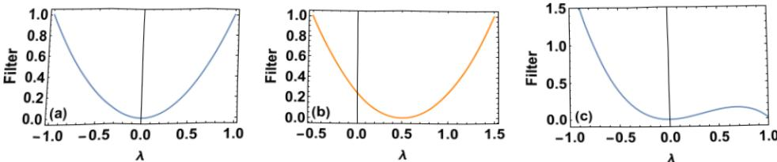

Figure 1. Schematic representation on how the regularization term acts onthe eigenmodes of the Dirac operator associated to the eigenvalue λ for different choices of the regularization kernel $\mathbf{Q}_{[n]}$ Panel (a) represents the Hodge Laplacian kernel $Q_{[n]}=({\bf D}_{[n]})^{2}$ corresponding to $m_{n}=0$ , panel (b) represents the Dirac signal processing kernel $Q_{[n]}=(\mathbf{D}_{[n]}\mathbf{-}m_{n}\mathbf{I})^{2}$ adopted in this study here with $m_{n}=0.5$ , while panel (c) represent the cubic kernel $Q_{[n]}\:=\:(\hat{\mathbf{D}}_{[n]})^{2}\:-\:z(\hat{\mathbf{D}}_{[n]})^{3}$ adopted in Ref. [55].Note that in the derivation for this filter [55] it was assumed that one considers the normalized Dirac operator $\hat{\mathbf{D}}_{[n]}$ having eigenvalues $|\lambda|\leq1$ (here represented for $z=0.99)$ 1. 

our task of filtering out signal components with an adjustable frequency (associated eigenvalue):

$$\mathbf{Q}_{[n]}(m_{n})=(\mathbf{D}_{[n]}-m_{n}\mathbf{I})^{2},$$

where $m_{n}$ is an a prioriunknown constantthatcanbeusedtotunethefiltering procedure. The solution of the optimization problem defined in $\mathrm{E q.(37)}$ is then 

$$\mathbf{\hat{s}}_{[n]}=[\mathbf{I}+\tau(\mathbf{D}_{[n]}-m_{n}\mathbf{I})^{2}]^{-1}\mathbf{\tilde{s}}_{[n]}.$$

which shows that signals aligned with eigenvectors corresponding to eigenvalues $\lambda\sim m_{n}$ will be attenuated least. Observe that, indeed, if we set $m_{1}=m_{2}=0$ ,we recover a 

standard Hodge Laplacian kernel, which promotes harmonic signals (see panel (a) and (b) of Fig. 1 for a schematic representation of the Hodge Laplacian and the Dirac regularization terms).

An essential question now is, of course, how we should set $m_{n}$ in the absence of a priori information about the true signal. Here we utilize the following observation to develop our Dirac signal processing algorithm. If we had access to the true signals $\mathbf{S}_{[n]}$ and we knew that these were associated to predominantly to a specific eigenvalue λ,then we should set $m_{n}=\lambda$ .Equivalently, we could use the information about $\mathbf{S}_{[n]}$ and $\mathbf{D}_{[n]}$ to compute $m_{n}$ as:

$$m_{n}=\frac{\mathbf{s}_{[n]}^{\top}\mathbf{D}_{[n]}\mathbf{s}_{[n]}}{\mathbf{s}_{[n]}^{\top}\mathbf{s}_{[n]}}=\lambda,$$

which follows from simple computations (observe that we are effectively computing a Rayleigh quotient). Crucially, while the true signal components are of course not available, for not too large signal-to-noise ratios, we may compute a proxy of the above statistic from the observed data.

The optimization problem (37) can be then solved iteratively, by first solving the optimization problem finding $\mathbf{\hat{S}}_{[n]}$ with the currently estimated estimated value ${\hat{m}}_{n}$ , and then refining the estimate ${\hat{m}}_{n}$ using $\mathbf{\hat{S}}_{[n]}$ , with 

$$\begin{aligned}\mathbf{\hat{s}}_{[n]}&=[\mathbf{I}+\tau(\mathbf{D}_{[n]}-\hat{m}_n\mathbf{I})^2]^{-1}\mathbf{\tilde{s}}_{[n]},\\\hat{m}_n&=\frac{\mathbf{\hat{s}}_{[n]}^{\top}\mathbf{D}_{[n]}\mathbf{\hat{s}}_{[n]}}{\mathbf{\hat{s}}_{[n]}^{\top}\mathbf{\hat{s}}_{[n]}}.\end{aligned}$$

This leads to the following unsupervised Dirac signal processing algorithm:

Require: Initial guess $\hat{m}_{n}^{(0)}$ ', Convergence threshold δ, Learning rate η, Measured data 

$\small\begin{array}{l}{\mathbf{\tilde{s}}_{[n]}}\\ {t\leftarrow0}\\ {\hat{m}_{n}(t=0)\leftarrow\hat{m}_{n}^{(0)}}\\ {\mathbf{w h i l e}|\hat{m}_{n}(t)-\hat{m}_{n}(t-1)|<\delta\mathbf{d o}}\\ {\quad t\leftarrow t+1}\\ {\quad\mathbf{\hat{s}}_{[n]}\leftarrow[\mathbf{I}-\tau(\mathbf{D}_{[n]}-m_{n}\mathbf{I})^{2}]^{-1}\mathbf{\tilde{s}}_{[n]}}\\ {\quad\hat{m}_{n}(t+1)\leftarrow(1-\eta)\hat{m}_{n}(t)+\eta\frac{\mathbf{\hat{s}}_{[n]}^{\top}\mathbf{D}_{[n]}\mathbf{\hat{s}}_{[n]}}{\mathbf{\hat{s}}_{[n]}^{\top}\mathbf{\hat{s}}_{[n]}}}\\ \end{array}$ 

$$\small\begin{array}{l}{\mathbf{\tilde{s}}_{[n]}}\\ {t\leftarrow0}\\ {\hat{m}_{n}(t=0)\leftarrow\hat{m}_{n}^{(0)}}\\ {\mathbf{w h i l e}|\hat{m}_{n}(t)-\hat{m}_{n}(t-1)|<\delta\mathbf{d o}}\\ {\quad t\leftarrow t+1}\\ {\quad\mathbf{\hat{s}}_{[n]}\leftarrow[\mathbf{I}-\tau(\mathbf{D}_{[n]}-m_{n}\mathbf{I})^{2}]^{-1}\mathbf{\tilde{s}}_{[n]}}\\ {\quad\hat{m}_{n}(t+1)\leftarrow(1-\eta)\hat{m}_{n}(t)+\eta\frac{\mathbf{\hat{s}}_{[n]}^{\top}\mathbf{D}_{[n]}\mathbf{\hat{s}}_{[n]}}{\mathbf{\hat{s}}_{[n]}^{\top}\mathbf{\hat{s}}_{[n]}}}\\ \end{array}end while 
$$

## end while 

Here we indicate the iteration of the algorithm with t, and require as parameters a convergence threshold δ, an initial guess for $m_{n}$ , denoted by $\hat{m}_{n}^{(0)}$ , and need to set a learning rate $0<\eta\leq1{\mathrm{~f o r~}}{\hat{m}}_{n}$ 

Note that the initial guess $\hat{m}_{n}^{(0)}$ may of course be computed by a Rayleigh coefficient using the observed data as well. This strategy is in particular well suited if the signalto-noise ratio is reasonably large; for a very low signal to noise ratio a good guess can be $m_{n}$ , h (see Appendix A for details).

## Dirac signal processingof higher-order topological signals 

An intuitive description of how the algorithm works is as follows. As discussed, the parameter $m_{n}(t)$ serves as an estimate of the eigenvalue(s) of the dominant eigenvector contribution(s) that can be found in the signal. This estimate $m_{n}(t)$ will then be used for a filtering round and thus will attenuate the frequencies around $m_{n}(t)$ the least. For a sufficiently close guess,this will result in an evenbetter estimate of the dominant signal part, and thus will lead to a convergence of the algorithm, by "locking $ in''$ the desired frequency components automatically in a data driven way. We remark that in practice some deviation of the true signal from a single frequency is tolerable, as long as the set of relevant eigenvalues remains reasonably compact.

If the true signal $\mathbf{S}_{[n]}$ is known, the performance of the algorithm can be evaluated by monitoring the error 

$$\Delta s_{n}=\|\mathbf{\hat{s}}_{[n]}-\mathbf{s}_{[n]}\|_{2},$$

within the loop as a function of the iteration count t.

Note that the algorithm above is adaptive in that the filtering will automatically adjust according to the initial input provided. This contrasts with the preliminary work we presented in [55], in which wefurther adopted a different (fixed) regularizer and worked with the normalized Dirac operator instead.

The main difference of the present algorithm with respect to the one we proposed in Ref. [55] are: (i) In [55] the signal processing algorithm uses the symmetrized version of the normalized Dirac operator defined in Ref. [57] instead of the unnormalized Dirac operator used here; (ii) the regularization term used in Ref. [55] uses $\boldsymbol{Q}=\hat{\mathbf{D}}^2-z\hat{\mathbf{D}}^3$ ; (iii the algorithm proposed in [55] does not learn any of its parameters. Overall Dirac signal processing provides an improvement with respect to the algorithm proposed in [55].The choice adopted here for the regularization term allows for a good performance of the Dirac signal processing on synthetic signals formed by arbitrary eigenvectors of the Dirac operators while the algorithm proposed in [55] is best suited to treat true signals constituted by the eigenvector corresponding to the largest positive eigenvalue of the Dirac operator or by its chiral eigenvector. Indeed by tuning the value of m the regularizationterm smooths the signal byselecting theeigenmodesaround $m_{n}$ while the regularization trm $\boldsymbol{Q}=\hat{\mathbf{D}}^{2}-z\hat{\mathbf{D}}^{3}$ has two minima that impede the reconstruction of arbitrary signals (see schematic representations of the filters in Fig. 1). Moreover the proposed Dirac signal processing is an algorithm that learns to eficiently filter the noisy signal, which is a clear advantage in an unsupervised framework. Finally we note that Dirac signal processing algorithm can be easily generalized by adopting the normalized Dirac operator instead of the unnormalized one, although in the cases analysed in this paper we have found no improvement of the performance of the algorithm. On the contrary the algorithm proposed in [55] can only be defined using the normalized Dirac operator.

#### 3.2. Numerical Experiments 

We conducted several numerical experiments on synthetic and real world data as described in the following.

3.2.1. Synthetic signals For synthetic data on networks and simplicial complexes in which the true (or noisy) topological signals are not available, the signal s is taken to be the linear composition of two signals $\mathbf{s}_{[1]}$ and $\mathbf{s}_{[2]}$ with $\mathbf{S}_{[n]}$ aligned with a single eigenvector of $\mathbf{D}_{[n]}$ corresponding to a non-degenerate eigenvalue (either $\phi_{n}^{+}\mathrm{o r}\phi_{n}^{-}$ for any choice of $n\in\{1,2\})$ ).

In particular we have 

$$\mathbf{s}=\mathbf{s}_{[1]}+\mathbf{s}_{[2]}$$

with 

$$\mathbf{s}_{[1]}=\boldsymbol{\phi}_{1}^{\pm},\quad\mathbf{s}_{[2]}=\boldsymbol{\phi}_{2}^{\pm},$$

where $\phi_{n}^{\pm}$ are defined in Eq. (28). Note that choosing both $\mathbf{s}_{[1]}$ and $\mathbf{S}_{[2]}$ proportional to eigenvectors associated to positive eigenvalues is a useful convention but the method works also with any other combination of eigenvectors associated to positive and negative eigenvalues.

Additionally, we can consider signals $\mathbf{S}_{[n]}$ built from linear combination of the eigenvectors of the Dirac operator with Gaussian coefficients, i.e.

$$\mathbf{s}_{[n]}=\sum_{\lambda\neq0}c_{\lambda}\phi_{n}(\lambda)$$

where $\phi_{n}(\lambda)$ indicates the eigenvector of $\mathbf{D}_{[n]}$ with eigenvalue λ and $c_{\lambda}=$ $1/\mathcal{Z}$ exp $\left(-(\lambda-\bar{\lambda})^{2}/2\hat{\sigma}\right)$ where $\mathcal{Z}$ is a normalization constant ensuring $\|\mathbf{s}_{[n]}\|_{2}=1$ and $\bar{\lambda},\hat{\sigma}$ are two parameters determining $\mathbf{S}_{[n]}$ .

3.2.2. Signals generated from real-world data For several real-world datasets there are topological signals available only for a subset of dimensions of interest. For instance, we might have network datasets formed by nodes and links where only node signals, or only link signals are available. Analogously, for a simplicial complex of dimension two, formed by nodes, links and triangles, we may have only access to signals supported on the links.In these cases we can use the available real-world data to generate synthetic datasets as follows. To generate the signals for the dimensions in which we have no measurements,we simply apply the Dirac operator to the observed signal, thus generating signals in all adjacent dimensions. More precisely, let σ indicate the topological spinor defined on nodes, links and triangles, that has non-zero elements only in one observed dimension.We then set our signal to:

$$\mathbf{s}_{[n]}=c_{n}(\pmb{\sigma}+\mathbf{D}_{[n]}\pmb{\sigma}),$$

where $c_{n}$ is a normalization constant that we set to enforce the condition $\|\mathbf{s}_{[n]}\|_{2}=1$ Hence, if σ is defined only on nodes $\mathbf{s}=\mathbf{s}_{[1]}+\mathbf{s}_{[2]}$ will be defined on both nodes and 

links, if σ is defined only on links $\mathbf{s}=\mathbf{s}_{[1]}+\mathbf{s}_{[2]}$ will be defined on nodes, links and triangles for simplicial complexes of dimension two.

3.2.3. Noise Model We model the noise vector ∈ as a standard Gaussian random vector,with elements drawn independently and identically at random:

$$\mathbf{x}\sim\mathcal{N}(0,\mathbf{I}).$$

The noise vector $\pmb{\epsilon}_{[n]}$ within each subspace im $(\mathbf{D}_{[n]})\;(n=1,2)$ can then be computed as:

$$\pmb{\epsilon}_{[n]}=\alpha_{n}\frac{\mathbf{D}_{[n]}\mathbf{D}_{[n]}^{\dagger}\mathbf{x}}{\sqrt{D_{n}}}$$

where $D_{n}=\left|\mathrm{im}(\mathbf{D}_{[n]})\right|$ isthedimiohohrmuof $\mathbf{D}_{n}$ .This ensures that on expectation the noise is normalised to $\alpha_{n}$ on $\mathrm{i m}(\mathbf{D}_{1})$ (i.e., nodes and links), or $\operatorname{i m}(\mathbf{D}_{2})$ (i.e. links and triangles), respectively. To quantify the noise within each subspace of the measured signal $\mathbf{\tilde{s}}_{n}=\mathbf{s}_{[n]}+\mathbf{\epsilon}_{[n]}$ , we define the signal to noise ratio as 

$$\mathrm{s n r}=\frac{\|\mathbf{s}_{[n]}\|^{2}}{\|\pmb{\epsilon}_{[n]}\|^{2}}$$

Since $\|\mathbf{s}_{[n]}\|^{2}=1$ by construction, this quantity is in expectation $1/\alpha_{n}^{2}$ 

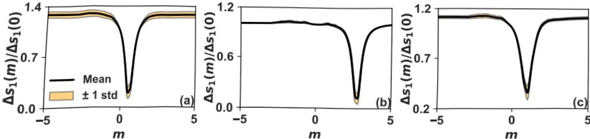

Figure 2. The ratio between the error in the filtered signal,$\Delta s_{1}(m)$ ,and the error obtained with the Hodge Laplacian filtering algorithm $\Delta s_{1}(0)$ 1,is shown for different values of the parameter m on the Florentine Families network of marriage relations [59]. The true signal is given by the eigenvector with smallest (panel (a))and largest (panel (b)) positive eigenvalue of the Dirac operator. Panel (c) presents the relative error in the case of true signal built as a linear combination of eigenmodes with Gaussian coeffi cients centred at $\bar{\lambda}=1$ with standard deviation $\hat{\sigma}=0.2$ . The ratio $\Delta s_{1}(m)/\Delta s_{1}(0)$ displays a minimum where the parameter m is equal to the true m of the signal. The parameters are $\alpha_{1}=0.6\mathrm{a n d}\tau=10$ . The relative error shown is averaged over 50iterations,and theshaded region corresponds to the $\pm1$ standard deviation interval around the mean. 

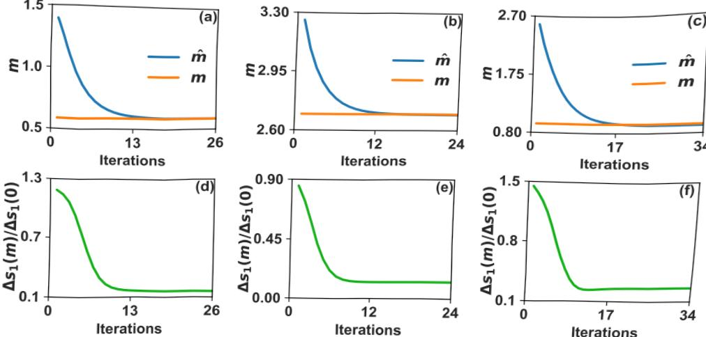

Figure 3. We illustrate the learning process of the Dirac signal processing over consecutive iterations of the algorithm applied to the Florentine Families network of marriage relations. Panels (a)-(c) compare the learned value  to the true m of the pure signal during the learning progresses until the algorithm converges. Panels (d)-(f) present the relative error $\Delta s(m)/\Delta s(0)$ ,where $\Delta s(0)$ represents the error in the estimated signal with the Hodge Laplacian $(m=0)$ 1. This error greatly reduces over the optimization. In panels (a) and (d), the true signal is given by the eigenvector of the Dirac operator with smallest (positive) eigenvalue in magnitude. In panels (b)and (e), it is given by the eigenvector with largest (positive) eigenvalue. In panels (c) and (f) the true signal is instead a linear combination of Dirac eigenmodes with Gaussian coeffi icients centred at $\bar{\lambda}=1$ , with standard deviation $\hat{\sigma}=0.2$ of the Dirac eigenvectors. The parameters are $\alpha_{1}=0.5,\tau=7$ in panels (a), (b), (d), (e) and $\tau=2$ in panels (c) and (f),$\eta=0.3,\;\delta=10^{-4}$ and $m_{1}^{(0)}=1.5$ in panels (a) and (d) and $m_{1}^{(0)}=3$ in panels (b), (c), (e) and (d). The signal to noise ratio are respectively 5.15,4.52 and 3.61 in the first, second and third column. 

### 4. Results 

#### 4.1. Application to the Florentine-Families network dataset 

To start with, we validate our algorithm on a network dataset, i.e. a simplicial complex of dimension one, only formed by nodes and links. In particular, we consider the marriage layer of the Florentine Families multiplex network [59]. This network is formed by $N_{[0]}=15$ nodes and $N_{[1]}=20$ links. The number of triads (2-simplices) is taken to be zero, i.e.$N_{[2]}=0$ so that $\mathbf{D}_{[2]}=\mathbf{0}$ .We consider as true signal either the eigenvector corresponding to the largest positive or to the smallest positive eigenvalue,

$$\mathbf{s}=\mathbf{s}_{[1]}=\phi_{1}^{+}.$$

To illustrate the effect of the parameter $m_{n}$ ,weinitiallylternoisysignalon this network by tuning the parameter $m_{1}=m$ rather than learning it, as shown in Fig. 2.

## Dirac signal processing of higher-order topological signals 

Figure 4. Visualization of the true signal (panel (a)) the noisy signal (panel (b))and the filtered signal (panel (c)) defined on nodes and links of the Florentine Family network [59]. The true signal is given by the eigenvector of the Dirac operator with smalle  e $\alpha_{1}$ i is 3.29. The filtered signal is obtained with $\tau=10,\:m_{1}=0.5,\:\eta=0.1$ and $\delta=10^{-4}$ The error is $\Delta s_{1}=0.14$ . The nodes' sizes and links' widths are proportional to the local value of the signal considered. The magnitude of the colorscale is logarithmic,except in the interval $[-0.005,0.005]$ where it is linear. 

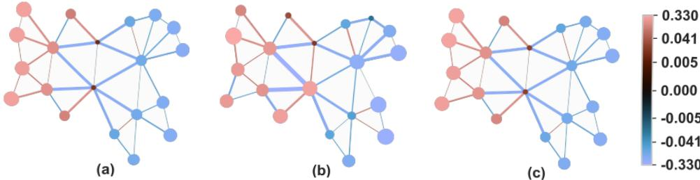

Figure 5. Visualization of the true signal (panel (a)) the noisy signal (panel (b)) and the filtered signal (panel (c)) defined on the nodes and links of a single realization of the NGF network [60] with parametrs $s_{{N G F}}=0{~}{\operatorname{a n d}}{~}\beta_{{N G F}}=0$ .The true signal is given by the eigenvector of the Dirac operator with smallest eigenvalue. The parameter $\alpha_{1}$ is taken to be 0.7, and the signal to noise ratio is 2.62. The filtered signal is obtained with $\tau=10$ $m_{1}=1.1$ $\eta=0.1$ .and $\delta=10^{-4}$ . The error obtained is $\Delta s_{1}=0.06$ . The nodes'sizes and links' widths are proportional to the local value of the signal considered. The magnitude of the colorscale is logarithmic, except in the interval $[-0.005,0.005]$ where it is linear. 

The error $\Delta s_{1}(m)$ in the reconstructed signal defined in Eq. (43) shows a drastic dip for $m=\lambda$ where λ is the eigenvalue corresponding to the true signal. Note that the minimal value of the error $\Delta s_{1}(m)$ |obtained with the optimal choice of the parameter $m=\lambda\neq0$ is much smaller than the error $\Delta s_{1}(m=0)$ that can be obtained with a standard signal processing algorithm using only the Hodge Laplacian i.e. the algorithm obtained for $m=0$ . This effect can be observed independently of the choice of the eigenvectorchosen forthe true signal (see Figure 2). Also considering a true signal formed by a linear combination of positive eigenvectors with Gaussian coefficients, can 

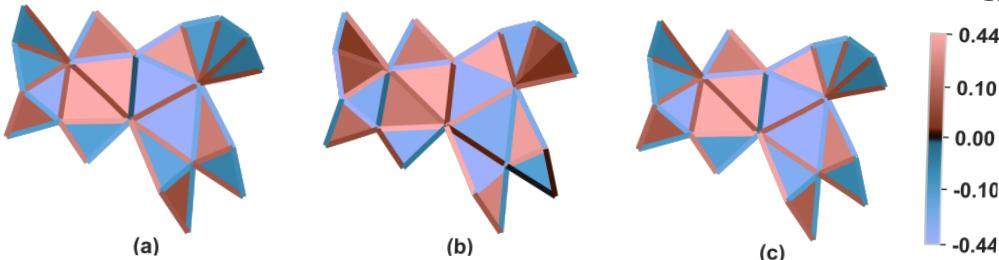

Figure 6. Visualization of the true signal (panel (a)) the noisy signal (panel (b)) and thefieal)diikofillio of the NGF network [60] with parameters $s_{N G F}=0\;\mathrm{a n d}\;\beta_{N G F}=0$ . The true signal is given by the eigenvector of the Dirac operator with smallest eigenvalue. The parameter $\alpha_{2}$ is taken to be 0.7, and the signal to noise ratio is 2.16. The filtered signal is obtained with $\tau=10,m_2=1.6,\eta=0.1and\delta=10^{-4}$ . The error obtained is $\Delta s_{2}=0.1$ . The magnitude of the colorscale is logarithmic, except in the interval $[-0.2,0.2]$ where it is linear. 

still lead to a well defined minimum of the relative error $\Delta s_{1}(m)/\Delta s_{1}(0)$ (see Figure 2c).

Furthermore, using the Dirac signal processing algorithm, we can learn the value of parameter m. This is illustrated in Fig. 3 where we show the learned parameter $\hat{m}$ versus the true parameter m as a function of the number of iterations of the algorithm, for signals aligned with single positive eigenvectors, as well as constructed as linear combination of different eigenvectors with Gaussian coefficients. In all cases,the proposed filtering is able to reconstruct the true signal much more closely than the Hodge-Laplacian filter, as revealed in the bottom row of Fig. 3. Furthermore, the filtering proposed reconstructs the considered signals with significant error reduction compared to the noisy signal input. We find for the signal built as a linear combination of Dirac eigenmodes with Gaussian coefficients considered in Fig. 3, the reduction reached is approximately 65%. For single eigenvectors, this furthermore can reach up to 90%.

This performance is illustrated visually in Fig. 4 where we compare in panel (a),(b) and (c) the true signal s[1], the measured signal with random noise added and the reconstructed signal $\mathbf{\hat{s}}_{[1]}$ . The reconstructed signal shows excellent visual agreement with the true signal.

#### 4.2. Application to the simplicial complex model NGF 

The Network Geometry with Flavor (NGF) [1,62, 63] is a very comprehensive model of growing simplicial complexes able to generate discrete manifolds and more general structures, whose 1-skeleton, (i.e. the network obtained by retaining only the nodes and links of the simplicial complex) has high clustering coefficient and high modularity. In certain limits the NGF reduces to existing models such as the Barabasi-Albert model or  
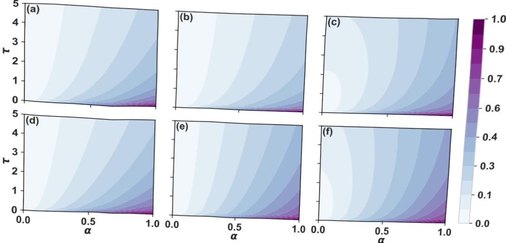

Figure 7. The absolute error $\Delta s_{n}(m)$ of the reconstructed signal with optimised m is shwn aa  $\alpha_{n}$ adopting different true signals. In panels (a) and (d) the true signal is given by the eigenvector with (positive) smallest eigenvalue of respectively $D_{[1]}$ and $D_{[2]}$ . In panels (b), (e), the true signal is given by the eigenvector with (positive) largest eigenvalue of respectively $D_{[1]}$ and $D_{[2]}$ . In panels (c) and (f) the true signal is given by a linear combination (with Gaussian coefficients) of eigenmodes of $D_{[1]}$ and $D_{[2]}$ eigenvectors respectively. In both cases the Gaussian coefficients are centred at $\bar{\lambda}=1$ and have standard deviation $\hat{\sigma}=0.2$ . The error shown is averaged over 10 realisations of noise.The parameters taken are $m_{1}^{(0)}=m_{2}^{(0)}=1$ in panels (a), (d),$m_{1}^{(0)}=m_{2}^{(0)}=3$ in panels (b), (e) and $m_{1}^{(0)}\:=\:\widetilde{m_{2}^{(0)}}\:=\:\widetilde{2}$ in panels (c), (f). The other parameters are $\eta=0.3$ and $\delta=10^{-4}$ for all panels. 

the Apollonian random graph model. Here we consider an NGF dataset of dimension $d=2i.e$ . formed by nodes, links and triangles which is a discrete manifold and can be generated by setting the NGF model parameters to $s_{N G F}=-1$ (flavor) and $\beta_{N G F}=0$ (inverse temperature). This generates discrete manifolds of dimension $d\;=\;2$ with exponential degree distributions. The code to generate the NGF simplicial complexes of any arbitrary dimension is freely available in the repository [60].

The simplicial complex being two dimensional, we can consider a true signal defined on nodes, links and triangles and test our complete algorithmic pipeline. In particular we take the true signals $\mathbf{s}_{[1]}$ and $\mathbf{s}_{[2]}$ given by Eq. 45 with $c_{1}=c_{2}=1$ and proportional to an arbitrary eigenvector associated to $\mathbf{D}_{[1]}$ and $\mathbf{D}_{[2]}$ respectively. In Figs. 5 and 6 we visualise the performance of our smoothing algorithm when the parameter m is learned for signals supported by nodes and links, and links and triangles respectively. In both cases, it is visually clear that our filtering approach can reconstruct the signal considered (in panel (c)) very closely to the true signal (in panel (a)) from the noisy measurement shown in panel (b).

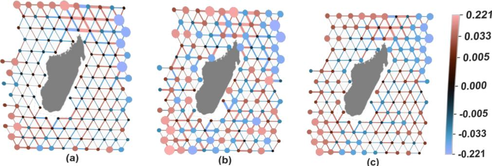

Figure 8. Visualization of the true signal (panel (a)) the noisy signal (panel (b)) and the filtered signal (panel (c)) defined on the nodes and links obtained from the drifter dataset onthe shoreof Madagascar61]. The parameter $\alpha_{1}$ is taken to be 1, and the signal to noise ratio is 1.1. The filtered signal is obtained with $\tau=0.5,\;m_1^{(0)}=1.1$ ,$\eta=0.3\mathrm{a n d}\delta=10^{-4}$ . The obtained error is $\Delta s_{1}=0.50$ .The nodes'sizes and links'widths are proportional to the local value of the signal considered. The magnitude of the colorscale is logarithmic, except in the interval [−0.005,0.005] where it is linear.The island of Madagascar is shown for visualization purposes only.

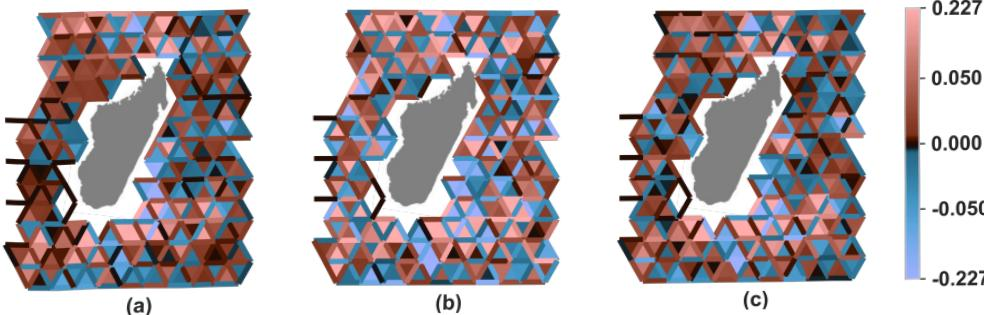

Figure 9. Visualization of the true signal (panel (a)) the noisy signal (panel (b))and the filtered signal (panel (c)) defined on the links and triangles obtained from the drifter dataset on the shore of Madagascar [61]. The parameter $\alpha_{2}$ is taken to be 1. and the signal to noise ratio is 1.03. The filtered signal is obtained with $\tau=1$ ,$m_{2}^{(0)}=1.6,\quad\eta=0.3and\delta=10^{-4}$ . The obtained error is $\Delta s_{2}=0.64$ . The magnitude of the colorscale is logarithmic, except in the interval [−0.1,0.1] where it is linear. The island of Madagascar is shown for visualization purposes only.

In Figure 7, we report the performance of the Dirac signal processing algorithm by measuring the error $\Delta s_{n}(\tau,\alpha)$ for $n\in\{1,2\}$ · defined as 

$$\Delta s_{n}=\|\mathbf{\hat{s}}_{[n]}(\tau,\alpha)-\mathbf{s}_{[n]}\|_{2},$$

as a function of the parameters τ and $\alpha_{n}=\alpha$ . We measure this error over 10 different iterationsof the noise,andreportthe mean in Fig. 7. For all singleeigenvectors 

considered as well as signals consisting of a linear combination of of eigenvectors with Gaussian coefficients, we find that the algorithm yields errors around $0.1-0.3$ for all values of α considered provided τ is large enough. Finally we also observe that the NGF model provides also a very solid benchmark to test the complexity of our algorithm (see for details Appendix B).

#### 4.3. Application to the drifter dataset 

We test the Dirac signal processing algorithm on the real dataset of drifters in the ocean from the Global Ocean Drifter Program available at the AOML/NOAA Drifter Data Assembly Center [61]. The drifters data set already analyzed in Ref. [16] consists of the individual trajectories of 339 buoys around the island of Madagascar in the pacific ocean.Projected onto a tessellation of the space, this yields 339 edge-flows, each representing the motion of a buoy between pairs of cells. The underlying simplicial complex iself consists of 133 nodes, 322 links and 186 triangles. In order to obtain a single topological signal spanning all links in the simplicial complex, we consider the link-wise sum of the 339 trajectories, which represent the net physical flow around the island. This signal on links can further be encoded in σ, a topological spinor with zero values on nodes and triangles of the 2-dimensional simplex defined by the geographical tessellation. A signal s spanning all three dimensions using Eq. (47). Physically, the generated signals on nodes and triangles then each respectively encode node wise source/sinks of the flow (discrete divergence), and local circulation around 2−dimensional triangles (discrete curl). Finally, using Eq. 21, we obtain our signals $\mathbf{S}_{[1]}$ and $\mathbf{S}_{[2]}$ , which we normalise to have unit norm. Noise vectors $\pmb{\epsilon}_{[1]}$ and $\pmb{\epsilon}_{[2]}$ obey Eq.(49). In Fig. 8, we show in panel (a),(b) and (c) respectively the signal $\mathbf{s}_{[1]}$ we aim to reconstruct, the noisy signal $\tilde{\mathbf{s}}_{[1]}$ and the filtered signal $\mathbf{\hat{s}}_{[1]}$ with optimized m. We see visually that the reconstructed signal is closer to the true signal than the measured noisy signal, confirming that Dirac signal processing is able to filter key features of the signal, and leave out noisy components.This can be similarly observed on the signal projected onto links and triangles as shown in Fig. 9.

The performance of the algorithm on this real data set can be evaluated by measuring the error for given value of m. This is reported in panels (a) and (b) of Fig. 10 together with the error obtained with a Hodge-Laplacian filtering. We observe in both cases an improvement of the Dirac signal processing over the Hodge Laplacian signal processing corresponding to $m=0$ I, over a significant range or values of $m$ . This improvement of the Dirac signal processing algorithm is more pronounced for the signals supported on links and triangles.

We moreoverfind that the unsupervised version of the Dirac signal processing algorithm where m is a learned parameter is effcient in this real scenario (see Fig. 10).Indeed for both $\mathbf{s}_{[1]}$ and $\mathbf{S}_{[2]}$ c)considered, we see that the ratio $\Delta s_{n}(m)/\Delta s_{n}(0)$ converges below 1,showing an improvement in reconstruction whenusing the Dirac operator compared to the algorithm using exclusively the Hodge Laplacian.

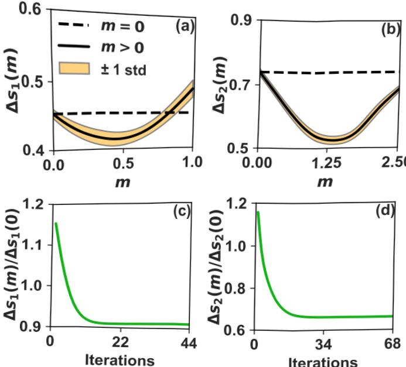

Figure 10. The relative error in the filtered signal of the data of drifters of the ocean [16, 61] is shown over different values of m, in comparison to the error obtained with a Hodge-Laplacian filtering $(m\;=\;0)$ J.The curve shown is averaged over 10realisations of noise. The region around the mean bounded by 1 standard deviation is shaded. The algorithm is applied to the nodes-links signal in panel (a) and to links-triangles signal in panel (b). In panels (c) and (d) we learn the parameter m and show the relative error over the learning process for a single iteration. The Dirac signal processing algorithm whose performance is shown in panels (c) and (d) is able to reduce significantly the error with respect to the Hodge-Laplacian filtering, however we do not observe convergence to the true value of m. The parameters are $\alpha_{n}=0.6$ .$\tau=1$ in panels (a) and (c);$\tau=1.5$ in panels (b) and (d) and $\eta=0.3,\delta=10^{-4}$ in panels (c) and (d). 

On average, this relative error reaches 0.85 and 0.65 respectively for nodes and links, and links and triangles signals.

### 5. Conclusions 

In this paper we have proposed the use of the Dirac operator to jointly process topological signals on simplicial complexes, and demonstrated the utility of theses ideas by presenting the Dirac signal processing algorithm to treat signals supported on nodes, links and triangles of simplicial complexes. Our algorithm exploits the chiral symmetry of the Dirac operator, i.e. the fact that for each positive eigenvalue there is a corresponding negative eigenvalue whose eigenvectors are chiral. Our proposed algorithm is furthermore adaptive in that it is able to learn the value of its parameter  mto efficientlyfilterthehigher-ordersignals.Wehave testedthisalgorithmonboth synthetic data of networks and simplicial complexes and on real data of drifting buoys in the ocean. We found good performance of the algorithm under very general conditions of the signals. Furthermore,we have demonstrated a significant improvement with respect to a corresponding algorithm using simply the Hodge Laplacian, showing that the Dirac operator can be a key ingredient to improve the filtering of topological data.We believe that this work opens new perspectives for the use of the Dirac operator for machine learning of topological signals and hope that it can inspire further work between topology and machine learning along this or other relevant research directions.For instance, an interesting direction for further exploration is the use of directional Dirac operators to distinguish between links of different types of directions in a given network [50].

## Data availability

The Florentine Families multiplex network is available from [64]. The drifter data are extracted from Global Ocean Drifter Program available at the AOML/NOAA Drifter Data Assembly Center [61].

## Code availability

The code to generate the simplicial complex "Network Geometry with Flavor” [62] is freely available at the repository [65]. All other codes used in this work are available upon request.

## Appendix A 

In this Appendix we investigate the convergence of our algorithm when the signal to noise ratio is reduced. To this end, we have compared the performance of the algorithm for two signal processing problems with a different level of the signal to noise ratio (see Fig. 11). In order to describe the difficulty of the task, we have plotted the error landscape of the algorithm obtained by measuring the normalized error of the algorithm when the value of m is externally tuned (see panels (a) and (b) of Fig.11). We observe clearly that the error landscape is more rough for lower signal to noise ratio implying that the reconstruction problem becomes more hard. In this setting, we measured the absolute difference between the true value of m and the learned value,$\hat{m}$ , as a function of the initial guess, indicated by $\hat{m}_{1}^{(0)}$ (see panels (c) and (d) of Fig.11). We observe that the convergence to the true value of m is impacted by the choice of the initial condition $\hat{m}_{1}^{(0)}$ in addition to the signal to noise ratio. In particular, for lower signal to noise ratio an initial condition $\hat{m}_{1}^{(0)}$ closer to the true value is required to have good convergence properties.

## Dirac signal processing of higher-order topological signals 

In either cases, as a rule of thumb, we find that lowering the value of the parameter τ i.e. reducingthe steepness of thefilter (see discussion above) can alleviate the severity of this issue. Furthermore, introducing stochasticity within the algorithm in order to escape such local extrema may improve the filtering performance. However this generalization of the algorithm is beyond the scope of this work and might be the subject of some future extension of Dirac signal processing. We note however that the algorithm preserves good convergence for a wide range of parameters as shown in Fig.7.

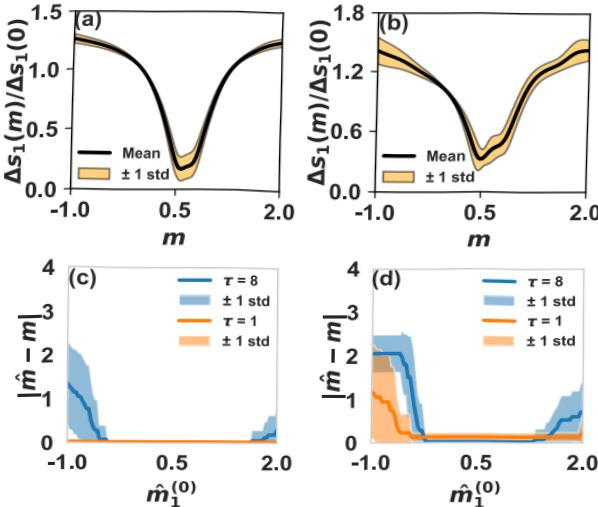

Figure 11. The average error in filtering the signal is shown relative to the Hodge Laplacian filter for a various range of fixed m in panels (a) and (b) on the node and links of a simplicial complex generated from the NGF model. Instead in panels (c) and (d), the parameter m is iteratively learned (denoted by m), and the average difference with the true m is instead plotted as a function of the initial guess used, denoted $\hat{m}_{1}^{(0)}$ for two values of τ. In panels (a) and $(\mathrm{c})$ ,theparameter $\alpha_{1}$ is set to 0.6, and the iterative process converges well for most $\widehat{\hat{m}_{1}^{(0)}}$ 1. In panels (b) and (d),$\alpha_{1}=1.5$ instead and the region of convergence is reduced. For all panels, the true signal is given by the eigenvector of $D_{[1]}$ with positive minimum eigenvalue, and 20 realisations of noise are considered. In panels (c) and (d),.$\eta=0.3$ and $\delta=10^{-4}$  

## Appendix B 

In this section we investigate the complexity of the proposed Dirac signal processing algorithm, as implemented in our (not optimized) code. In particular in Fig. 12 we show the average time taken for the algorithm to converge as a function of the size of the NGF simplicial complex. We focus in particular on the complexity of the algorithm filtering signals in the image of $D_{[1]}$ localized on nodes and links. This approximately 

follows a power law scaling in $N+L$ , and a simple fit to such a model evaluates the scaling exponent to $2.38\pm0.026$ . For this analysis, signals on simplicial complexes of up to 1600 nodes (equivalent to signals of dimension $N+L=3197)$ !were processed, each taking under 2 minutes. This confirms that in its current implementation, the algorithm is applicable to data sets of practically relevant sizes. Furthermore, the measured time was obtained on a local computer, and we expect further work focused on optimising the method to improve this performance.

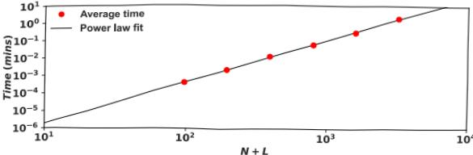

Figure 12. The average optimization time (algorithm runtime) is shown for signals on the node and links of simplicial complexes generated from the NGF model with increasing sizes. For each simplicial complex size, the time measured is averaged over the optimization of 20 pure and noisy signals. Each signal considered is given by a linear combination (with Gaussian coefficients centred at $\bar{\lambda}=1$ with standard deviation $\hat{\sigma}=0.2)$ of eigenvectors of .$D_{[1]}$ . The initial parameter $m_{1}^{(0)}$ is here given by a Rayleigh coefficient using the observed data. The other optimization parameters are $\eta=0.3$ and $\delta=10^{-4}$ . The data can be fitted to a power law with scaling $2.38\pm0.026$ 

## References 

[1] Ginestra Bianconi. Higher-order networks: An introduction to simplicial complexes. Cambridge University Press, 2021.
[2] Federico Battiston, Giulia Cencetti, Iacopo Iacopini, Vito Latora, Maxime Lucas, Alice Patania,
Jean-Gabriel Young, and Giovanni Petri. Networks beyond pairwise interactions: structure and dynamics. Physics Reports, 874:1–92, 2020.
[3] Federico Battiston, Enrico Amico, Alain Barrat, Ginestra Bianconi, Guilherme Ferraz de Arruda,
Benedetta Franceschiello, Iacopo Iacopini, Sonia Kéfi, Vito Latora, Yamir Moreno, et al. The physics of higher-order interactions in complex systems. Nature Physics, 17(10):1093-1098,
2021.
[4] Christian Bick, Elizabeth Gross, Heather A Harrington, and Michael T Schaub. What are higherorder networks? arXiv preprint arXiv:2104.11329, 2021.
[5] Leo Torres, Ann S Blevins, Danielle Basset, and Tina Eliassi-Rad. The why, how, and when of representations for complex systems. SIAM Review, 63(3):435–485, 2021.[6] Chad Giusti, Robert Ghrist, and Danielle S Bassett. Two's company, three (or more) is a simplex.
Journal of Computational Neuroscience, 41(1):1–14, 2016.
[7] Michael W Reimann, Max Nolte, Martina Scolamiero, Katharine Turner, Rodrigo Perin, Giuseppe Chindemi, Pawel Dlotko, Ran Levi, Kathryn Hess, and Henry Markram. Cliques of neurons bound into cavities provide a missing link between structure and function. Frontiers in Computational Neuroscience, page 48, 2017.
roadmap for the computation of persistent homology. EPJ Data Science, 6:1–38, 2017.

[9] Kelin Xia and Guo-Wei Wei. Persistenthomologyanalysisof proteinstructure,flexibility, and folding.International journal for numericalmethodsinbiomedicalengineering,30(8):8–844,2014.
[10] GiovanniPetri,Paul Expert,Federico Turkheimer,RobinCarhart-Harris,DavidNut,eter J Hellyer, and Francesco Vaccarino. Homological scafolds of brain functional networks. Journal of The Royal Society Interface, 11(101):20140873, 2014.
[11] Soumen Majhi, Matja Perc, and Dibakar Ghosh. Dynamics on higher-order networks: A review.
Journal of the Royal Society Interface, 19(188):20220043, 2022.
[12] Sergioarbarossaand tefania ardlltiTopological signal processingover imlicialcomplexes.
IEEE Transactions on Signal Processing, 68:2992–3007, 2020.
[13] Ana P Millán, Joaqun J Torres, and Ginestra Bianconi. Explosive higher-order Kuramoto dynamics on simplicial complexes. Physical Review Letters, 124(21):218301, 2020.[14] Joaquín J Torres and Ginestra Bianconi. Simplicial complexes: higher-order spectral dimension and dynamics. Journal of Physics: Complexity, 1(1):015002, 2020.[15] M. T. Schaub and S. Segarra. Flow smoothing and denoising: Graph signal processing in the edge-space. In 2018 IEEE Global Conference on Signal and Information Processing (GlobalSIP),
pages 735–739, 2018.
[16] Michael T Schaub, Austin R Benson, Paul Horn, Gabor Lippner, and Ali Jadbabaie. Random walks on simplicial complexes and the normalized Hodge 1-Laplacian. SIAM Review, 62(2):353391, 2020.
[17] Claudio Batiloro, Paolo Di Lorenzo,and Sergio Barbarossa. Topological slepians: Maximally localized representations of signals over simplicial complexes. In ICASSP 2023-2023 IEEE International Conference on Acoustics, Speech and Signal Processing (ICASSP), pages 1–5.
IEEE, 2023.
[18] Joshua Faskowitz, Richard F Betzel, and Olaf Sporns. Edges in brain networks: Contributions to models of structure and function. Network Neuroscience, 6(1):1–28, 2022.[19] Andrea Santoro, Federico Battiston, Giovanni Petri, and Enrico Amico. Higher-order organization of multivariate time series. Nature Physics, pages 1–9, 2023.
[20] Leo J Grady and Jonathan R Polimeni. Discrete calculus: Applied analysis on graphs for computational science, volume 3. Springer, 2010.
[21] Mathieu Desbrun, Anil N Hirani, Melvin Leok, and Jerrold E Marsden. Discrete exterior calculus.
arXiv preprint math/0508341, 2005.
[22] Reza Ghorbanchian, Juan G Restrepo, Joaquin J Torres, and Ginestra Bianconi. Higher-order simplicial synchronizationof coupledtopological signals. Communications Physics,4(1):–13,
2021.
[23] Lucille Calmon, Juan G Restrepo, Joaquin J Torres, and Ginestra Bianconi. Dirac synchronization is rhythmic and explosive. Communications Physics, 5(1):1–17, 2022.[24] Lorenzo Giambagli, Lucille Calmon, Riccardo Muolo, Timoteo Carletti, and Ginestra Bianconi.
Diffusion-driven instability of topological signals coupled by the Dirac operator. Phys. Rev. E,
2022.
[25] Lucille Calmon and Ginestra Bianconi. Local Dirac synchronization on networks. Chaos: An Interdisciplinary Journal of Nonlinear Science, 33(3):033117, 2023.[26] Cameron Ziegler, Per Sebastian Skardal, Haimonti Dutta, and Dane Taylor. Balanced Hodge Laplacians optimize consensus dynamics over simplicial complexes. Chaos: An Interdisciplinary Journal of Nonlinear Science, 32(2):023128, 2022.
[27] Alexis Arnaudon, Robert L Peach, Giovanni Petri, and Paul Expert. Connecting Hodge and Sakaguchi-Kuramoto: a mathematical framework for coupled oscillators on simplicial complexes.
arXiv preprint arXiv:2111.11073, 2021.
[28] Reza Ghorbanchian, Vito Latora, and Ginestra Bianconi. Hyper-diffusion on multiplex networks.
JPhys Complexity, 3:035009, 2022.
[29] Naoki Saito, Stefan C. Schonsheck, and Eugene Shvarts. Multiscale transforms for signals on  simplicial complexes. arXiv preprint arXiv:2301.02136, 2022.
[30] Cristian Bodnar, Fabrizio Frasca, Yuguang Wang, Nina Otter, Guido F Montufar,Pietro Lio, and Michael Bronstein. Weisfeiler and Lehman go topological: Message passing simplicial networks.
In International Conference on Machine Learning, pages 1026–1037. PMLR, 2021.[31] Christopher Wei Jin Goh, Cristian Bodnar, and Pietro Liò. Simplicial attention networks. arXiv preprint arXiv:2204.09455, 2022.
[32] Lorenzo Giusti, Claudio Battiloro, Paolo Di Lorenzo, Stefania Sardellitti, and Sergio Barbarossa.
Simplicial neural attention networks. arXiv preprint arXiv:2203.07485, 2022.[33] Michael M Bronstein, Joan Bruna, Yann LeCun, Arthur Szlam, and Pierre Vandergheynst.
Geometric deep learning: going beyond Euclidean data. IEEE Signal Processing Magazine,
34(4):18–42, 2017.
[34] Lek-Heng Lim. Hodge Laplacians on graphs. Siam Review, 62(3):685–715, 2020.[35] Michael T. Schaub, Yu Zhu, Jean-Baptiste Seby, T. Mitchell Roddenberry, and Santiago Segarra.
Signal processing on higher-order networks: Livin' on the edge …. and beyond. Signal Processing,
187:108149, 2021.
[36] Michael T Schaub, Jean-Baptiste Seby, Florian Frantzen, T Mitchell Roddenberry, Yu Zhu, and Santiago Segarra. Signal processing on simplicial complexes. In Higher-Order Systems, pages 301–328. Springer, 2022.
[37] Maosheng Yang, Elvin Isufi, Michael T. Schaub, and Geert Leus. Finite impulse response filters for simplicial complexes. In Eusipco 2021, 2021. accepted for publication.[38] Stefania Sardelliti,Sergio Barbarossa,and Lucia Testa.Topological signal processing over cl complexes. In 2021 55th Asilomar Conference on Signals, Systems, and Computers, pages 1558–1562. IEEE, 2021.
[39] T Mitchell Roddenberry, Michael TSchaub,and Mustafa Hajij. Signalprocessing oncell complexes. In ICASSP 2022-2022 IEEE International Conference on Acoustics, Speech and Signal Processing (ICASSP), pages 8852–8856. IEEE, 2022.
[40] Sanjukta Krishnagopal and Ginestra Bianconi. Spectral detection of simplicial communities via Hodge Laplacians. Physical Review E, 104(6):064303, 2021.
[41] ClaudioBattiloro,StefaniaSardelltti,Sergio Barbarossa,and Paolo Di Lorenzo. Topologial signal processing over weighted simplicial complexes. In ICASSP 2023-2023 IEEE International Conference on Acoustics, Speech and Signal Processing (ICASSP), pages 1–5. IEEE, 2023.[42] T Mitchell Roddenberry and Santiago Segarra. HodgeNet: Graph neural networks for edge data.
In 2019 53rd Asilomar Conference on Signals, Systems, and Computers, pages 220–224. IEEE,
2019.
[43] T Mitchell Roddenberry, Nicholas Glaze, and Santiago Segarra. Principled simplicial neural networks for trajectory prediction. In International Conference on Machine Learning, pages 9020–9029. PMLR, 2021.
[44] Stefania Ebli, Michal Defferrard, and Gard Spreemann. Simplicial neural networks. arXiv preprint arXiv:2010.03633, 2020.
[45] Mustafa Hajij, Kyle Istvan, and Ghada Zamzmi. Cell complex neural networks. arXiv preprint arXiv:2010.00743, 2020.
[46] Claudio Battiloro, Indro Spinelli, Lev Telyatnikov, Michael Bronstein, Simone Scardapane, and Paolo Di Lorenzo. From latent graph to latent topology inference: Differentiable cell complex module. arXiv preprint arXiv:2305.16174, 2023.
[47] Xue Gong, Desmond J Higham, and Konstantinos Zygalakis. Directed network Laplacians and random graph models. Royal Society Open Science, 8(10):211144, 2021.[48] Xitong Zhang, Yixuan He, Nathan Brugnone, Michael Perlmutter, and Matthew Hirn. Magnet:
A neural network for directed graphs. Advances in Neural Information Processing Systems,
34:27003–27015, 2021.
[49] Lucas Böttcher and Mason A Porter. Complex networks with complex weights. arXiv preprint arXiv:2212.06257, 2022.

[50]Ginestrianconi.ThetopologicalDiraequatioofnetworksandsimlicialcomplexes.JPhys Complexity, 2:035022, 2021.
[51] Ginestra Biancoi.Diracgaugetheoryfortopologicalspinorsin3+1dimensionalnetworks.J.
Phys. A: Math. Theor., 56:275001, 2023.
[52] Seth Lloyd,Silvano Garnerone, and Paolo Zanardi. Quantum algorithms for topological and geometric analysis of data. Nature Communications, 7(1):1–7, 2016.
[53] Bernardo Ameneyro, Vasileios Maroulas, and George Siopsis. Quantum persistent homology.
arXiv preprint arXiv:2202.12965, 2022.
[54] Olaf Post. First order approach and index theorems for discrete and metric graphs.In Annals Henri Poincar´é, volume 10, pages 823–866. Springer, 2009.
[55] LucilleCalmon,MichalT Schaub,and GinestraBianconi. Higher-ordersignal processing with the Dirac operator. In 2022 56th Asilomar Conference on Signals, Systems, and Computers,
Pacific Grove, CA, USA, pages 925–929. IEEE, 2022.
[56] Allen Hatcher. Algebraic topology. Cambridge University Press, 2005.
[57] Federica Baccini, Filippo Geraci,and Ginestra Bianconi. Weighted simplicial complexes and their representation powerof higher-ordernetwork data andtopology. Physical Review E,
106(3):034319, 2022.
[58] Lucille Calmon,JuanGRestrepo, JoaquJ Torres,and GinestraBianconiDiracsynchronization is rhythmic and explosive. Communications Physics, 5(1):1–17, 2022.
[59] Manlio DeDomenico.Datasets Released for Reproducibility.https://manliodedomenico.com/
data.php. Accessed: 12-20-2022.
[60] GinestraBianconi. Ginestraianconi GitHubpage.https://github.com/ginestrab.Accessed:
12-20-2022.
[61] Atlantic andOceanographic Meteorological Laboratory:Environmental Data Server Global Lagrangian Drifter Data. https://www.aoml.noaa.gov/envids/gld/.
[62] Ginestra Bianconi and Christoph Rahmede. Network geometry with flavor: from complexity to quantum geometry. Physical Review E, 93(3):032315, 2016.
[63] Ginestra Bianconi and Christoph Rahmede. Emergent hyperbolic network geometry. Scientific Reports, 7(1):1–9, 2017.
[64] https://manliodedomenico.com/data.php.
[65] https://github.com/ginestrab.
